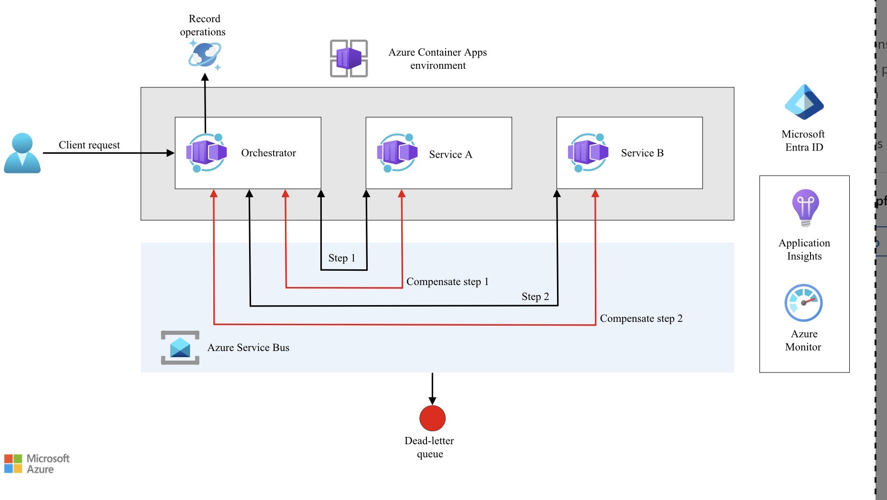
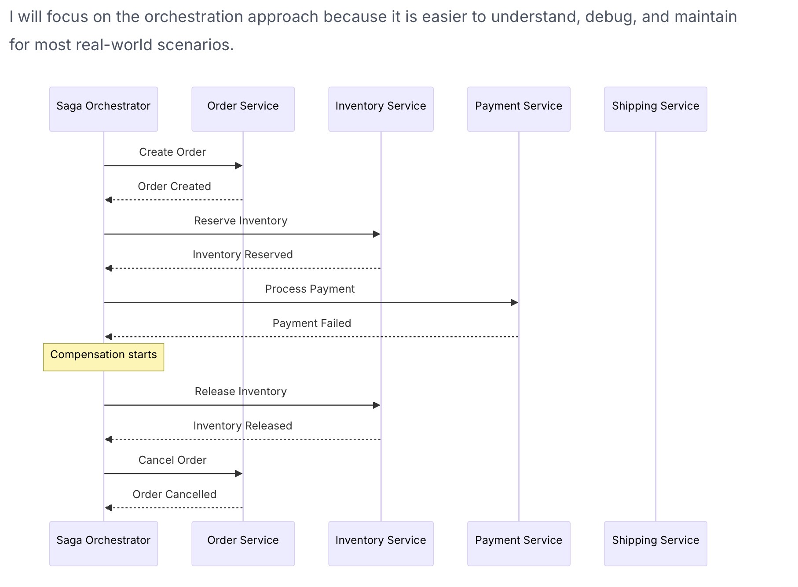

# SAGA
## When to use?
You need to ensure data consistency in a distributed system without tight coupling.
You need to roll back or compensate if one of the operations in the sequence fails.

## Design Pattern
A saga is a sequence of local transactions(tasks) where each service performs its operation and initiates the next step through events or messages. If a step in the sequence fails, the saga performs **compensating transactions** to undo the completed steps

A Transaction -> Unit of Work -> subdeivided into a sequence of Tasks
 - Each task is triggered by a Command message and executed as a local transaction
 - One local transaction generates an event/command to trigger next Task
 - if any local transaction fails, triggers a compensating transaction in rverse order to rollback
 - An intermediate step is pivot transaction, once you pass this step transaction can be rolled back.  

 ## Approaches
Choreography - each service listens for events and decides what to do next.
Orchestration - a central orchestrator service tells each participant what to do and handles the decision logic.


 ## Compensating Transaction
- Maintain data consistency
- handle single step failure gracefully
- Execute steps in reverse order
    - Continue forward processing when one step completes
    - When failure happens in a single step, execute steps in reverse order

**Key Considerations**
- Design local transaction for idempotancy since it involves mutiple retries
- handle timeouts with dead-letter queues, 
- persist saga state for recovery


  

### Azure Service Bus Transaction
You can use TransactionScope to ensure local Service Bus operations are atomic within a single namespace

Service Bus transactions only cover broker operations (Send/Complete); they do not automatically roll back database changes.
```
var options = new ServiceBusClientOptions { EnableCrossEntityTransactions = true };
await using var client = new ServiceBusClient(connectionString, options);

ServiceBusReceiver receiver = client.CreateReceiver("input-queue");
ServiceBusSender nextStepSender = client.CreateSender("next-step-queue");

var receivedMessage = await receiver.ReceiveMessageAsync();

using (var ts = new TransactionScope(TransactionScopeAsyncFlowOption.Enabled))
{
    try 
    {
        // 1. Perform local business logic (e.g., DB update)
        // 2. Complete incoming message and send next command atomically
        await receiver.CompleteMessageAsync(receivedMessage);
        await nextStepSender.SendMessageAsync(new ServiceBusMessage("Next Task"));
        
        ts.Complete();
    }
    catch (Exception ex)
    {
        // If local logic fails, message returns to queue for retry.
        // If it's a non-transient error, move to DLQ or send a compensation message.
    }
}
```

### Brute Force
```
public class OrderProcessor
{
    private readonly IOrderService _orderService;
    private readonly IInventoryService _inventoryService;
    private readonly IPaymentService _paymentService;
    private readonly IShippingService _shippingService;

    public OrderProcessor(IOrderService orderService, IInventoryService inventoryService,
        IPaymentService paymentService, IShippingService shippingService)
    {
        _orderService = orderService;
        _inventoryService = inventoryService;
        _paymentService = paymentService;
        _shippingService = shippingService;
    }

    public async Task<bool> ProcessOrderAsync(Order order)
    {
        var compensations = new Stack<Func<Task>>();

        try
        {
            // Step 1: Create Order
            await _orderService.CreateOrderAsync(order);
            compensations.Push(() => _orderService.CancelOrderAsync(order.Id));

            // Step 2: Reserve Inventory
            await _inventoryService.ReserveInventoryAsync(order.Items);
            compensations.Push(() => _inventoryService.ReleaseInventoryAsync(order.Items));

            // Step 3: Process Payment
            await _paymentService.ProcessPaymentAsync(order.PaymentInfo);
            compensations.Push(() => _paymentService.RefundPaymentAsync(order.PaymentInfo));

            // Step 4: Initiate Shipping
            await _shippingService.InitiateShippingAsync(order);

            return true;
        }
        catch (Exception)
        {
            // If any step fails, execute 
                        await ExecuteCompensatingActionsAsync(compensations);
            return false;
        }
    }

    private async Task ExecuteCompensatingActionsAsync(Stack<Func<Task>> compensations)
    {
        while (compensations.Count > 0)
        {
            var compensation = compensations.Pop();
            await compensation();
        }
    }
}
```

### Use Finite State Machine
 ``` C#
// Defines the steps and compensations for the order saga
public class OrderSagaDefinition
{
    // Each step has a forward action and a compensating action
    public static readonly SagaStep[] Steps = new[]
    {
        new SagaStep
        {
            Name = "CreateOrder",
            CommandQueue = "order-commands",
            CommandType = "CreateOrder",
            CompensationCommandType = "CancelOrder"
        },
        new SagaStep
        {
            Name = "ReserveInventory",
            CommandQueue = "inventory-commands",
            CommandType = "ReserveInventory",
            CompensationCommandType = "ReleaseInventory"
        },
        new SagaStep
        {
            Name = "ProcessPayment",
            CommandQueue = "payment-commands",
            CommandType = "ProcessPayment",
            CompensationCommandType = "RefundPayment"
        },
        new SagaStep
        {
            Name = "ArrangeShipping",
            CommandQueue = "shipping-commands",
            CommandType = "ArrangeShipping",
            CompensationCommandType = "CancelShipping"
        }
    };
}

// Tracks the state of a running saga instance
public class SagaState
{
    public string SagaId { get; set; }
    public string Status { get; set; }  // Running, Compensating, Completed, Failed
    public int CurrentStep { get; set; }
    public Dictionary<string, object> Data { get; set; }
    public List<string> CompletedSteps { get; set; }
    public string FailureReason { get; set; }
    public DateTime StartedAt { get; set; }
    public DateTime UpdatedAt { get; set; }
}
 ```

 ```
 // The saga orchestrator processes replies and advances the saga
public class OrderSagaOrchestrator
{
    private readonly ServiceBusSender[] _senders;
    private readonly CosmosContainer _sagaStore;

    // Start a new saga
    public async Task StartSaga(OrderRequest request)
    {
        // Create the initial saga state
        var sagaState = new SagaState
        {
            SagaId = Guid.NewGuid().ToString(),
            Status = "Running",
            CurrentStep = 0,
            Data = new Dictionary<string, object>
            {
                ["orderId"] = request.OrderId,
                ["customerId"] = request.CustomerId,
                ["items"] = request.Items,
                ["totalAmount"] = request.TotalAmount
            },
            CompletedSteps = new List<string>(),
            StartedAt = DateTime.UtcNow,
            UpdatedAt = DateTime.UtcNow
        };

        // Persist the saga state
        await _sagaStore.CreateItemAsync(sagaState);

        // Send the first command
        await SendStepCommand(sagaState, OrderSagaDefinition.Steps[0]);
    }

    // Process a reply from a service
    public async Task HandleReply(SagaReply reply)
    {
        // Load the current saga state
        var sagaState = await _sagaStore.ReadItemAsync<SagaState>(
            reply.SagaId, new PartitionKey(reply.SagaId));

        var state = sagaState.Resource;

        if (reply.Success)
        {
            // Step succeeded - record it and move to the next step
            state.CompletedSteps.Add(
                OrderSagaDefinition.Steps[state.CurrentStep].Name);
            state.CurrentStep++;

            if (state.CurrentStep >= OrderSagaDefinition.Steps.Length)
            {
                // All steps completed successfully
                state.Status = "Completed";
                state.UpdatedAt = DateTime.UtcNow;
                await _sagaStore.ReplaceItemAsync(state, state.SagaId);
                return;
            }

            // Send the next step command
            state.UpdatedAt = DateTime.UtcNow;
            await _sagaStore.ReplaceItemAsync(state, state.SagaId);
            await SendStepCommand(state, OrderSagaDefinition.Steps[state.CurrentStep]);
        }
        else
        {
            // Step failed - start compensating
            state.Status = "Compensating";
            state.FailureReason = reply.ErrorMessage;
            state.UpdatedAt = DateTime.UtcNow;
            await _sagaStore.ReplaceItemAsync(state, state.SagaId);

            // Start compensation from the last completed step
            await StartCompensation(state);
        }
    }

    // Send compensation commands in reverse order
    private async Task StartCompensation(SagaState state)
    {
        // Walk backwards through completed steps
        for (int i = state.CompletedSteps.Count - 1; i >= 0; i--)
        {
            var stepName = state.CompletedSteps[i];
            var step = OrderSagaDefinition.Steps.First(s => s.Name == stepName);

            await SendCompensationCommand(state, step);
        }
    }

    // Send a command to a service queue
    private async Task SendStepCommand(SagaState state, SagaStep step)
    {
        var message = new ServiceBusMessage(
            JsonSerializer.Serialize(new SagaCommand
            {
                SagaId = state.SagaId,
                CommandType = step.CommandType,
                Data = state.Data
            }))
        {
            // Correlation ID links all messages in a saga
            CorrelationId = state.SagaId,
            Subject = step.CommandType,
            // Reply queue for the response
            ReplyTo = "saga-replies",
            // Timeout for this step
            TimeToLive = TimeSpan.FromMinutes(5)
        };

        var sender = _serviceBusClient.CreateSender(step.CommandQueue);
        await sender.SendMessageAsync(message);
    }
}
 ```

```
// Inventory service processes reserve and release commands
[Function("InventoryCommandHandler")]
public async Task HandleCommand(
    [ServiceBusTrigger("inventory-commands", Connection = "ServiceBusConnection")]
    ServiceBusReceivedMessage message,
    ServiceBusMessageActions messageActions,
    FunctionContext context)
{
    var logger = context.GetLogger("InventoryCommandHandler");
    var command = JsonSerializer.Deserialize<SagaCommand>(message.Body);

    SagaReply reply;

    try
    {
        switch (command.CommandType)
        {
            case "ReserveInventory":
                // Try to reserve inventory for all items
                var items = JsonSerializer.Deserialize<List<OrderItem>>(
                    command.Data["items"].ToString());

                foreach (var item in items)
                {
                    var reserved = await _inventoryRepo.TryReserve(
                        item.ProductId, item.Quantity, command.SagaId);

                    if (!reserved)
                    {
                        // Not enough stock - release any reservations made so far
                        await _inventoryRepo.ReleaseReservation(command.SagaId);

                        reply = new SagaReply
                        {
                            SagaId = command.SagaId,
                            Success = false,
                            ErrorMessage = $"Insufficient stock for product {item.ProductId}"
                        };
                        await SendReply(message.ReplyTo, reply);
                        await messageActions.CompleteMessageAsync(message);
                        return;
                    }
                }

                reply = new SagaReply
                {
                    SagaId = command.SagaId,
                    Success = true
                };
                break;

            case "ReleaseInventory":
                // Compensation - release the reservation
                await _inventoryRepo.ReleaseReservation(command.SagaId);

                reply = new SagaReply
                {
                    SagaId = command.SagaId,
                    Success = true
                };
                break;

            default:
                throw new InvalidOperationException(
                    $"Unknown command type: {command.CommandType}");
        }

        await SendReply(message.ReplyTo, reply);
        await messageActions.CompleteMessageAsync(message);
    }
    catch (Exception ex)
    {
        logger.LogError(ex, "Failed to process command {Type} for saga {SagaId}",
            command.CommandType, command.SagaId);

        // Send failure reply so the orchestrator can compensate
        reply = new SagaReply
        {
            SagaId = command.SagaId,
            Success = false,
            ErrorMessage = ex.Message
        };
        await SendReply(message.ReplyTo, reply);
        await messageActions.CompleteMessageAsync(message);
    }
}

```

